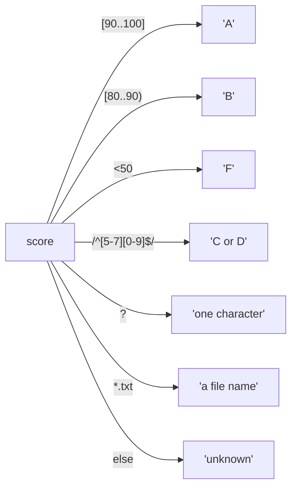

# Label forms

Run with: `merman run examples/grades.md --set score=85`

```mermaid
flowchart LR
    s["score"] -->|"[90..100]"| a["'A'"]
    s -->|"[80..90)"| b["'B'"]
    s -->|"<50"| d["'F'"]
    s -->|"/^[5-7][0-9]$/"| c["'C or D'"]
    s -->|"?"| ch["'one character'"]
    s -->|"*.txt"| f["'a file name'"]
    s -->|else| z["'unknown'"]
```
