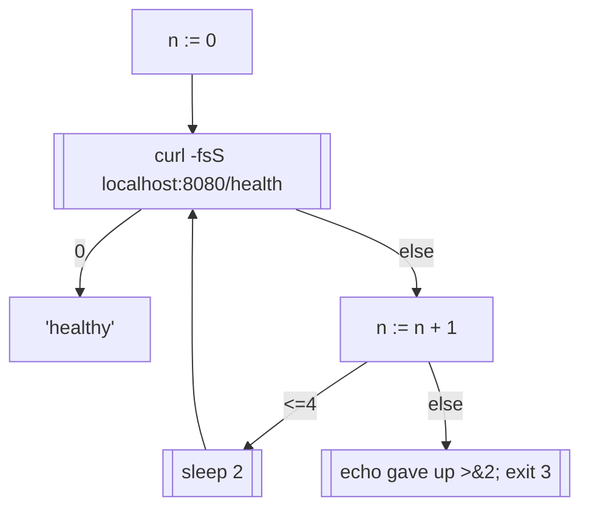

# Retry loop

Polls a health endpoint up to five times, then fails with exit code 3.

```mermaid
flowchart TD
    init["n := 0"] --> check
    check[["curl -fsS localhost:8080/health"]] -->|0| ok["'healthy'"]
    check -->|else| bump["n := n + 1"]
    bump -->|"<=4"| wait[["sleep 2"]]
    wait --> check
    bump -->|else| fail[["echo gave up >&2; exit 3"]]
```
