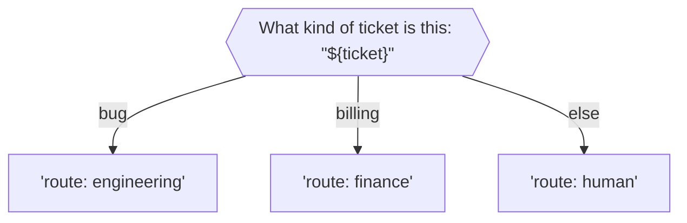

# LLM triage

Run with: `merman run examples/triage.md --set ticket="charged twice"`

```mermaid
flowchart TD
    classify{{"What kind of ticket is this: #quot;${ticket}#quot;"}} -->|bug| eng["'route: engineering'"]
    classify -->|billing| fin["'route: finance'"]
    classify -->|else| human["'route: human'"]
```